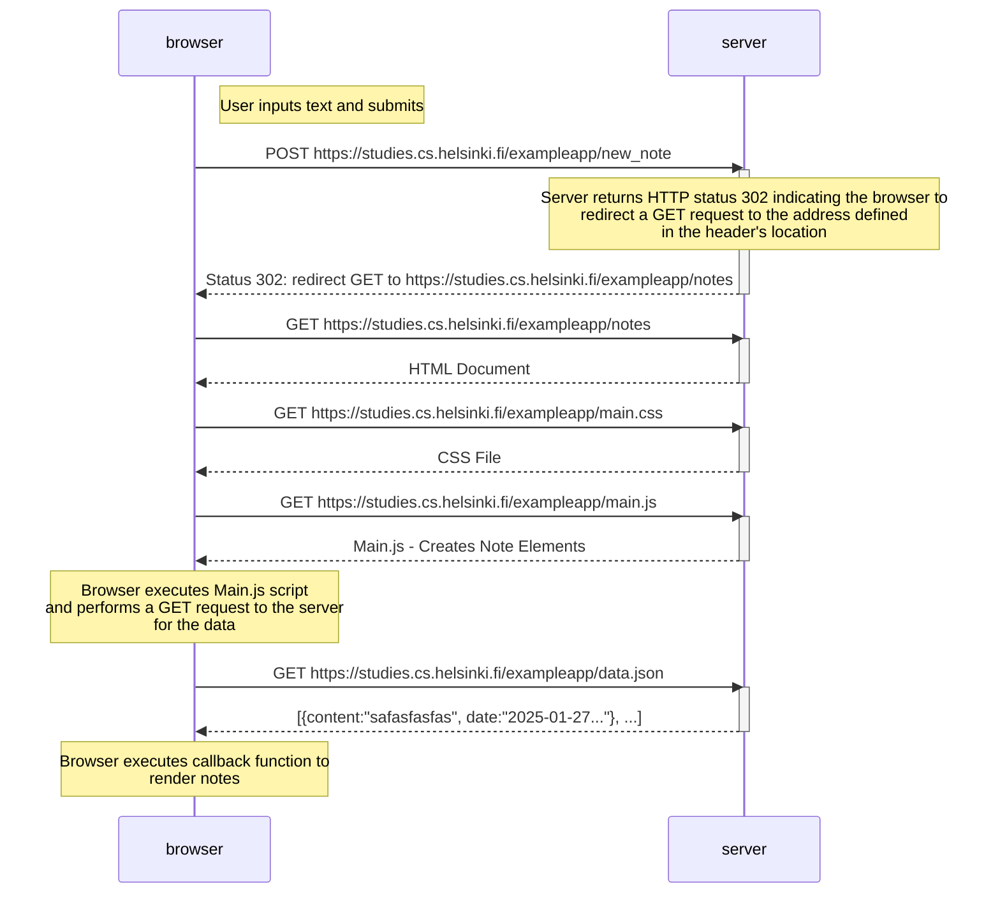

```mermaid
sequenceDiagram
    participant browser
    participant server

    Note right of browser: User inputs text and submits
    browser->>server: POST https://studies.cs.helsinki.fi/exampleapp/new_note

    activate server
    Note over server: Server returns HTTP status 302 indicating the browser to <br/>redirect a GET request to the address defined <br/>in the header's location
    server-->>browser: Status 302: redirect GET to https://studies.cs.helsinki.fi/exampleapp/notes
    deactivate server

    browser->>server: GET https://studies.cs.helsinki.fi/exampleapp/notes
    activate server
    server-->>browser: HTML Document
    deactivate server
    
    browser->>server: GET https://studies.cs.helsinki.fi/exampleapp/main.css
    activate server
    server-->>browser: CSS File
    deactivate server

    browser->>server: GET https://studies.cs.helsinki.fi/exampleapp/main.js
    activate server
    server-->>browser: Main.js - Creates Note Elements
    deactivate server

    Note over browser: Browser executes Main.js script <br/>and performs a GET request to the server <br/>for the data
    browser->>server: GET https://studies.cs.helsinki.fi/exampleapp/data.json
    activate server
    server-->>browser: [{content:"safasfasfas", date:"2025-01-27..."}, ...]
    deactivate server

    Note over browser: Browser executes callback function to <br/>render notes
```