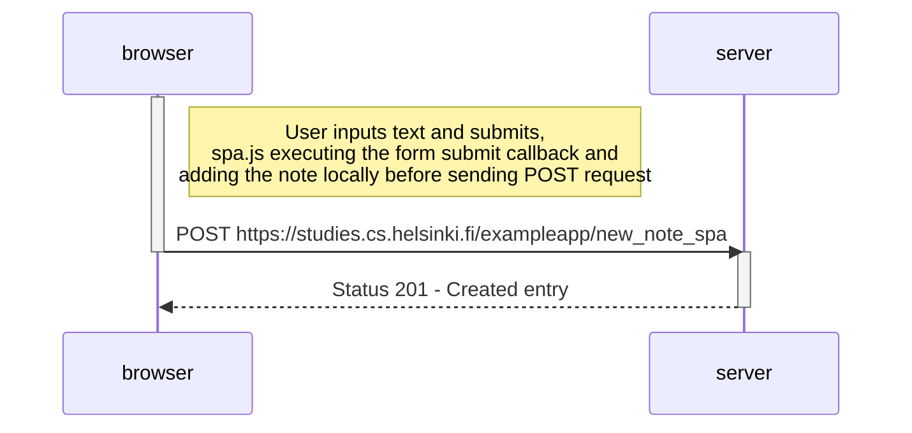

```mermaid
sequenceDiagram
    participant browser
    participant server

    activate browser
    Note right of browser: User inputs text and submits, <br/>spa.js executing the form submit callback and <br/>adding the note locally before sending POST request
    
    browser->>server: POST https://studies.cs.helsinki.fi/exampleapp/new_note_spa
    deactivate browser
    activate server
    server-->>browser: Status 201 - Created entry
    deactivate server
```